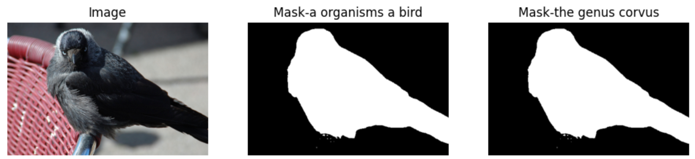

# 🎨 Mask-OVEN-Wiki Dataset for PL-VEL
**Reverse Region-to-Entity Annotation for Pixel-Level Visual Entity Linking**  *(AAAI 2025)*
<div align="left">

<p align="left">
    <a href="https://arxiv.org/abs/2412.13614"></a>
    <a href="https://huggingface.co/datasets/NP-NET/mask-oven-wiki"></a>
    
    
</p>


[[GitHub]](https://github.com/NP-NET-research/PL-VEL) [[Paper]](https://arxiv.org/abs/2412.13614) [[Hugging Face]](https://huggingface.co/datasets/NP-NET/mask-oven-wiki)

</div>


## 📖 Overview

**Mask-OVEN-Wiki** is an automatically annotated dataset designed for **pixel-level visual entity linking**, extending the [OVEN dataset](https://open-vision-language.github.io/oven/). It introduces pixel-level masks for entities in images to enable fine-grained visual grounding. Mask-OVEN-Wiki dataset includes **5,245,421 annotations** across **5,214,965 images** from the OVEN dataset, covering **20,077 distinct entities**. We retained OVEN's knowledge base, which contains **6,063,945 Wikipedia entities**, with **2,032,340 entities** having corresponding images. This setup bridges text-image alignments at both entity and pixel levels.


## 📥 Download Data
### 1. Mask-OVEN-Wiki Annotations
Available on Hugging Face: [NP-NET/mask-oven-wiki](https://huggingface.co/datasets/NP-NET/mask-oven-wiki)

| Dataset      | Split   | Size    | Images   | Mentions  | Entities | Link                                                                 |
|--------------|---------|---------|----------|-----------|----------|----------------------------------------------------------------------|
| **Entity Set** | Train   | 12.5 GB | 4.46M    | 4.46M     | 7.9k     | [📥 Download](https://huggingface.co/datasets/NP-NET/mask-oven-wiki/blob/main/mask_oven_entity_train.json) |
| **Entity Set** | Val     | 498 MB  | 108k     | 108k      | 3.2k     | [📥 Download](https://huggingface.co/datasets/NP-NET/mask-oven-wiki/blob/main/mask_oven_entity_val.json)   |
| **Entity Set** | Test    | 2.97 GB | 608k     | 608k      | 15.9k    | [📥 Download](https://huggingface.co/datasets/NP-NET/mask-oven-wiki/blob/main/mask_oven_entity_test.json)  |
| **Query Set**  | Train   | 96.2 MB | 19.8k    | 23.5k     | 2.5k     | [📥 Download](https://huggingface.co/datasets/NP-NET/mask-oven-wiki/blob/main/mask_oven_query_train.json)  |
| **Query Set**  | Val     | 8.3 MB  | 1.8k     | 1.9k      | 632      | [📥 Download](https://huggingface.co/datasets/NP-NET/mask-oven-wiki/blob/main/mask_oven_query_val.json)    |
| **Query Set**  | Test    | 58.1 MB | 14.1k    | 15.4k     | 5.4k     | [📥 Download](https://huggingface.co/datasets/NP-NET/mask-oven-wiki/blob/main/mask_oven_query_test.json)   |
| **Human Set**  | -       | 25.5 MB | 3.6k     | 4.3k      | 2.3k     | [📥 Download](https://huggingface.co/datasets/NP-NET/mask-oven-wiki/blob/main/mask_oven_human_test.json)   |
| **Wiki Set**   | -       | 5.37 GB | 2.03M    | 1.97M     | 2.03M    | [📥 Download](https://huggingface.co/datasets/NP-NET/mask-oven-wiki/blob/main/mask_oven_wiki_split.json)   |

### 2. OVEN Images & Knowledge Base
- **Images**: Follow [OVEN guidelines](https://github.com/edchengg/oven_eval/tree/main/image_downloads).
- **Knowledge Base**:
  - [Full Info (6.9G)](http://storage.googleapis.com/gresearch/open-vision-language/Wiki6M_ver_1_0.jsonl.gz)
  - [Title Only (419M)](http://storage.googleapis.com/gresearch/open-vision-language/Wiki6M_ver_1_0_title_only.jsonl)


## 📌 Example

```json
{
    "images": [{"id": "oven_04925844", "file_name": "/04/oven_04925844.jpg", "height": 333, "width": 500}],
  "categories": [{"id": "Q388450", "name": "Crow"}],
  "annotations": [
      {
          "id": "oven_query_val_00000107",
      "image_id": "oven_04925844",
      "category_id": "Q388450",
      "segmentation": [{"size": [333, 500], "counts": "..."}, ...],
      "bbox": [[92.76, 11.17, 498.73, 331.54], ...],
      "text_prompt": "A organisms known by a particular common name named 'crow'...",
      "label": ["a organisms a bird(0.44)", "the genus corvus(0.31)"],
      "question": "what kind of bird is this?",
      "data_split": "query_val_seen"
    }
  ]
}
```
<p align="center">
    
</p>

## 🚀 Usage
### Step 1: Install Dependencies
```bash
pip install pycocotools
```

### Step 2: Load Data with COCO API
```python
import json
from pycocotools.coco import COCO

# Load annotations
ann_file = "path/to/mask_oven_query_val.json"
coco = COCO(ann_file)

# Explore images
image_ids = coco.getImgIds()[:3]
for img_id in image_ids:
    img = coco.loadImgs(img_id)[0]
    print(f"ID: {img['id']}, File: {img['file_name']}, Size: {img['width']}x{img['height']}")

# Explore annotations
ann_ids = coco.getAnnIds(imgIds=image_ids)
anns = coco.loadAnns(ann_ids)
for ann in anns:
    print(f"Label: {ann['label']}, Bbox: {ann['bbox']}, Mask: {ann['segmentation']}")
```

### Step 3: Decode Masks
```python
from pycocotools import mask as mask_util

# Decode RLE to numpy array
rle = anns[0]['segmentation'][0]
mask = mask_util.decode(rle)

# Merge multiple masks
def merge_masks(rles):
    masks = [mask_util.decode(rle) for rle in rles]
    return np.bitwise_or.reduce(masks)

mask_merged = merge_masks(anns[0]['segmentation'])
```


## 📝 Citation
If you use Mask-OVEN-Wiki, please cite:
```bibtex
@article{xu2024reverse,
  title={Reverse Region-to-Entity Annotation for Pixel-Level Visual Entity Linking},
  author={Xu, Zhengfei and Zhao, Sijia and Hao, Yanchao and Liu, Xiaolong and Li, Lill and Yin, Yuyang and Li, Bo and Chen, Xi and Xin, Xin},
  journal={arXiv preprint arXiv:2412.13614},
  year={2024}
}
```


## 🌟 Acknowledgments
Special thanks to the [OVEN dataset](https://open-vision-language.github.io/oven/), [GroundedSAM](https://github.com/IDEA-Research/Grounded-Segment-Anything), [SEEM](https://github.com/UX-Decoder/Segment-Everything-Everywhere-All-At-Once) for foundational work!  
For issues, contact [@NP-NET-research](https://github.com/NP-NET-research) or [@xuzf-git](https://github.com/xuzf-git).